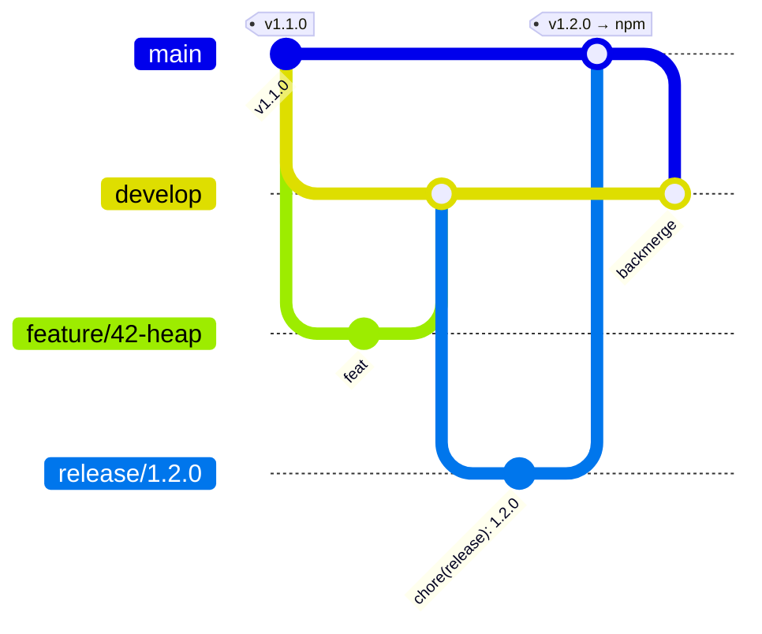

# Contributing and release process

The project uses **Git Flow**. Every change reaches `main` and npm only through a pull request
and a green CI.



## Branches

| Branch                   | Created from | Merged into | Purpose                                             |
| ------------------------ | ------------ | ----------- | --------------------------------------------------- |
| `develop`                | —            | —           | Main development branch, default branch of the repo |
| `feature/<issue>-<name>` | `develop`    | `develop`   | One issue, e.g. `feature/38-ci-cd`                  |
| `release/X.Y.Z`          | `develop`    | `main`      | Version bump and changelog for a release            |
| `hotfix/X.Y.Z`           | `main`       | `main`      | Urgent fix of a published version                   |
| `main`                   | —            | —           | Released code. Every commit here is on npm          |

## Everyday work

1. Create an issue and a branch for it:
   ```bash
   git switch develop && git pull
   git switch -c feature/<issue>-<short-name>
   ```
2. Commit, push, open a pull request into `develop`.
3. Add a line to the `## [Unreleased]` section of [`CHANGELOG.md`](CHANGELOG.md).
4. Merge when CI is green (squash or merge commit).

Do **not** change `version` in `package.json` in feature branches — CI rejects it.

## Release

```bash
git switch develop && git pull
version=$(npm version minor --no-git-tag-version)   # patch | minor | major, prints vX.Y.Z
git switch -c "release/${version#v}"
# CHANGELOG.md: rename "## [Unreleased]" to "## [X.Y.Z] - YYYY-MM-DD", add a new empty "## [Unreleased]"
git commit -am "chore(release): ${version#v}"
git push -u origin "release/${version#v}"
```

`npm version` bumps `package.json` and `package-lock.json` without creating a tag — the tag is
created by CI after publishing.

Open a pull request `release/X.Y.Z` → `main` and merge it with a **merge commit**
(squash would make `main` and `develop` diverge). After the merge the
[`Publish`](.github/workflows/publish.yml) workflow:

1. runs the full CI again on `main`;
2. publishes `ts-ds@X.Y.Z` to npm with provenance (skipped if this version is already on npm);
3. creates the tag `vX.Y.Z` and a GitHub release with notes from the changelog;
4. opens a **backmerge** pull request `main` → `develop`.

Merge the backmerge pull request with a **merge commit**. Delete the release branch.

## Hotfix

```bash
git switch main && git pull
version=$(npm version patch --no-git-tag-version)
git switch -c "hotfix/${version#v}"
# fix, update CHANGELOG.md, commit, push, open a pull request into main
```

The rest is the same as a release, including the backmerge into `develop`.

## Version control

The `version-policy` CI check ([`.github/scripts/check-version-policy.mjs`](.github/scripts/check-version-policy.mjs)) enforces:

- into `main`: only from `release/X.Y.Z` or `hotfix/X.Y.Z`; `package.json` version equals `X.Y.Z`,
  is greater than the version on `main` and on npm, tag `vX.Y.Z` does not exist yet,
  `CHANGELOG.md` has a `## [X.Y.Z]` section;
- into `develop`: the version must not change, except in pull requests from `main`,
  `release/*` or `hotfix/*`.

Versions follow [Semantic Versioning](https://semver.org): `patch` for fixes,
`minor` for new features, `major` for breaking changes.

## CI checks

[`CI`](.github/workflows/ci.yml) runs on every pull request and on pushes to `develop` and `main`.
Run the same checks locally before pushing:

```bash
npm ci
npm run format:check   # Prettier
npm run typecheck      # TypeScript
npm run test:coverage  # Vitest, coverage thresholds 90%
npm run build
npm pack --dry-run     # what would be published: only build/, README, LICENSE
```

## Security of the pipeline

- Third-party actions are pinned to a full commit SHA with the version in a comment
  (`uses: actions/checkout@<sha> # v7.0.1`). Tags can be moved by an attacker, SHAs cannot.
- Dependabot updates the SHAs, the version comments and npm dev dependencies weekly
  (pull requests into `develop`, with a 7-day cooldown for new releases).
- npm publishing uses [trusted publishing](https://docs.npmjs.com/trusted-publishers) (OIDC):
  there is no npm token in the repository.
- Workflows get the minimal `permissions` they need.

## One-time repository setup

These settings live in GitHub and npm, not in the code. The repository has one maintainer,
so no approvals are required — the maintainer merges their own pull requests once CI is green.

1. **Settings → General**
   - Default branch: `develop`.
   - Pull requests: allow merge commits and squash merging; enable _Automatically delete head branches_.
2. **Settings → Actions → General → Workflow permissions**
   - _Read repository contents and packages permissions_.
   - Enable _Allow GitHub Actions to create and approve pull requests_ (needed for the backmerge PR).
3. **Settings → Rules → Rulesets → New ruleset → Import a ruleset**
   - Import [`.github/rulesets/main.json`](.github/rulesets/main.json) and
     [`.github/rulesets/develop.json`](.github/rulesets/develop.json).
   - Both require a pull request (0 approvals) and the `verify` and `version-policy` checks,
     and forbid force-push and deletion. `main` accepts merge commits only.
     Repository admins can bypass in an emergency.
4. **npmjs.com → package `ts-ds` → Settings → Trusted publishing**
   - GitHub Actions, repository `pluhsoft/ts-ds`, workflow `publish.yml`, no environment.

## Code style

- TypeScript strict mode, generics for data structures.
- Prettier formats the code: `npm run format`.
- Every feature has tests next to the code (`*.test.ts`).
